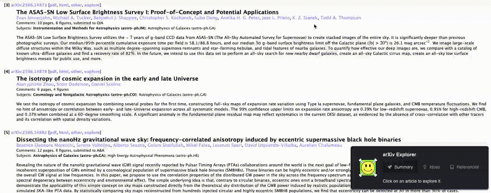

# Arxiv Explorer

## Table of Contents

- [chrome-extension](./packages/chrome-extension/README.md)
- [api](./packages/api/README.md)
- [rds-migrations](./packages/rds-migrations/README.md)
- [infrastructure](./packages/infrastructure/README.md)
- [types](./packages/types/README.md)

ArXiv explorer is a chrome extension that allows you to get a highl-evel overview of a research paper on
[arxiv.org](https://arxiv.org/). It provides a summary of the paper, explanations of the key concepts, and suggestions for further reading.
It is built using generative AI and is designed to help researchers and students quickly understand the key
points of a paper without having to read the entire document.

Current features include:

- It uses generative AI to provide summaries and explanations of the papers.
- Provides suggestions for new unexplored ideas.
- Generates a list of related documents to read to better understand the paper.

# Code Structure

The code is structured as a [typescript](https://www.typescriptlang.org/) monorepo using [yarn workspaces](https://classic.yarnpkg.com/en/docs/workspaces/).
This allows us to share code between the different packages and makes it easier to manage dependencies.
Below is a brief overview of the packages in the monorepo:

# Architecture

```mermaid
flowchart LR
    subgraph Client
        CE[Chrome Extension]
        CE -->|1. Authorize<br/>(Cognito)<br/>| Cog[Cognito User Pool]
        CE -->|2. Run in Browser| Br[Browser Runtime]
        Br -->|3. Call API<br/>(API Gateway)| APIGW[API Gateway]
    end

    subgraph Backend
        APIGW -->|4. Process Request| BE[Backend Service]
        BE -->|4.1 Call External API| OA[OpenAI API]
        BE -->|5. Store Data| DB[(RDS Database)]
    end
```

## Packages

### chrome-extension

This package contains the code for the chrome extension.

It uses the [Manifest V3](https://developer.chrome.com/docs/extensions/mv3/intro/) and is built using React.
Components are written using [Chakra UI v3](https://chakra-ui.com/) for styling.

### api

This package contains the code for the API that provides the backend functionality for the chrome extension.
It is an [express](https://expressjs.com/) server that provides endpoints for the chrome extension to interact with.

### rds-migrations

This package contains the code for the RDS migrations.

It uses a non-opinionated approach to migrations, allowing you to write your own SQL queries to create
and modify the database schema. [node-pg](https://node-postgres.com/) is used to interact with the PostgreSQL database.

### infrastructure

This package contains the code for the infrastructure that is used to deploy the application.

It uses [cdk](https://docs.aws.amazon.com/cdk/latest/guide/work-with-cdk-typescript.html) to define the infrastructure as code.
It includes the configuration for the API, RDS, and other AWS resources that are used to deploy the application.

### types

This package contains the types that are used accross the application.

# Running the Application

To run the application, you need to have [Node.js](https://nodejs.org/) and [Yarn](https://classic.yarnpkg.com/en/docs/install/) installed on your machine. To install the dependencies, run the following command in the root directory of the monorepo:

```bash
yarn install
```

## Deploying the auth stack

In order to run the application, you need to deploy at least the auth stack. This allows the application to authenticate users and manage their sessions.
To deploy the auth stack, you can use the following command:

```bash
yarn workspace @arxiv-explorer/infrastructure deploy ArxivExplorerAuthStack
```

## Define environment variables

After the auth stack is deployed, define the following environment variables

```bash
export VITE_IDENTITY_POOL_ID="us-east-1:3c8f0b2d-4a5e-4c6b-9f7d-8e1f2a3b4c5d"
export VITE_USER_POOL_ID="us-east-1_123456789"
export VITE_USER_POOL_CLIENT_ID="abcdefghijklmnopqrs"
```

## Running a local instance of the database

To run a local instance of the database, you can use [Docker](https://www.docker.com/) to run a PostgreSQL container. Define the variables

```bash
export RDS_HOST="localhost"
export RDS_PORT="5432"
export RDS_DB_NAME="postgres"
export RDS_USERNAME="some-username"
export RDS_PASSWORD="some-password"
export RDS_DATABASE_URL="postgresql://${RDS_USERNAME}:${RDS_PASSWORD}@${RDS_HOST}:${RDS_PORT}/${RDS_DB_NAME}"
```

and run the following command:

```bash
yarn workspace @arxiv-explorer/rds-migrations docker:build
```

and then run the migrations to create the database schema:

```bash
yarn workspace @arxiv-explorer/rds-migrations migrate up
```

at this point you should have a local instance of the database running and the schema created.

## Running the API

To run the API, you can use the following command:

```bash
yarn workspace @arxiv-explorer/api run:local
```

This will start the API server on `http://localhost:3002`.

## Running the Chrome Extension

To run the Chrome extension, you need to build the extension and load it into Chrome. Youcan do this by running the following command:

```bash
yarn workspace @arxiv-explorer/chrome-extension dev
```

### Loading the extension in Chrome

1. Open Chrome and go to `chrome://extensions/`.
2. Enable "Developer mode" in the top right corner.
3. Click on "Load unpacked" and select the `dist` directory inside the `@arxiv-explorer/chrome-extension` package.
4. The extension should now be loaded and you should see it in the list of extensions.
5. You can now click on the extension icon in the Chrome toolbar to open the popup and start using the extension.

## Usng the Application

Once the extension is loaded, you can navigate to any paper on [arxiv.org](https://arxiv.org/) and click on the extension icon in the Chrome toolbar to open the popup. Login and you should see an `explore` next to each paper. Clicking on it will open the extension popup with the summary, explanations, and suggestions for further reading.


